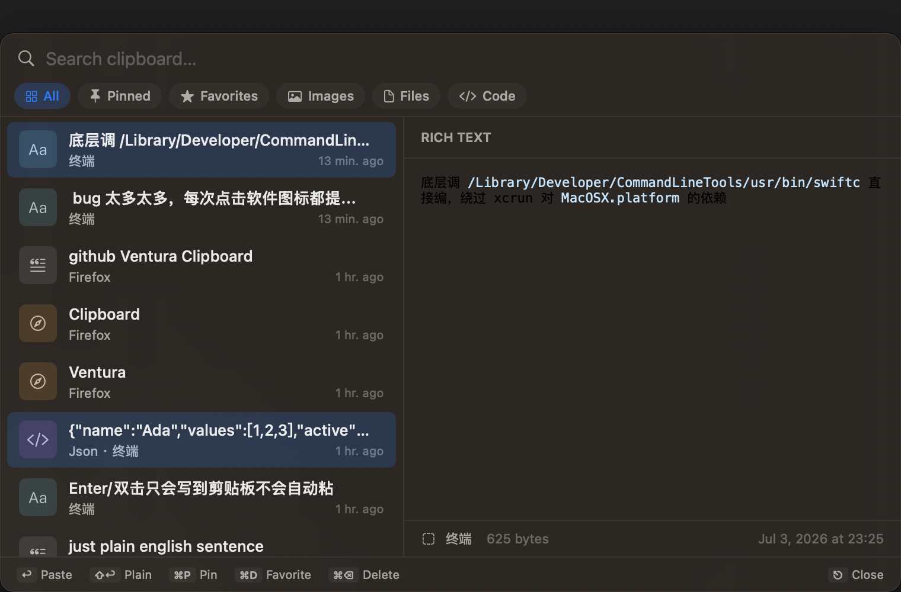
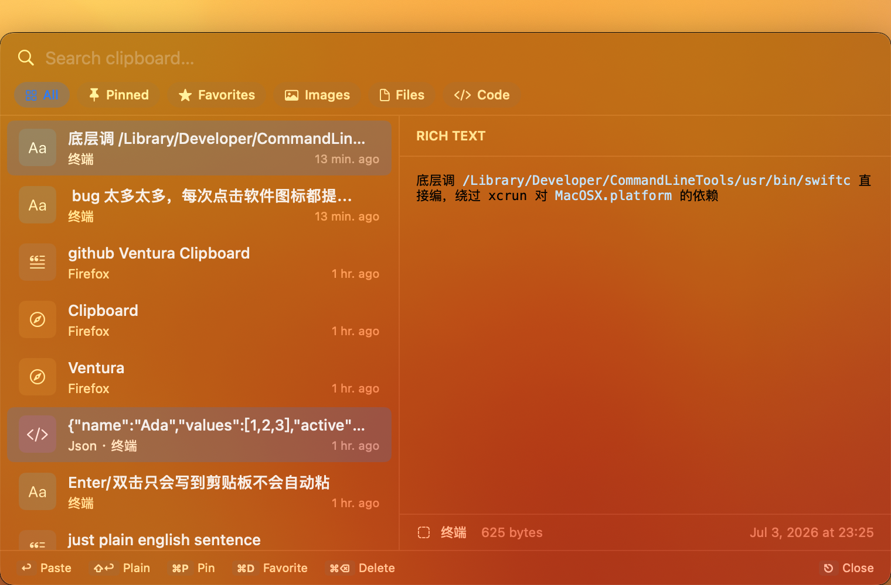
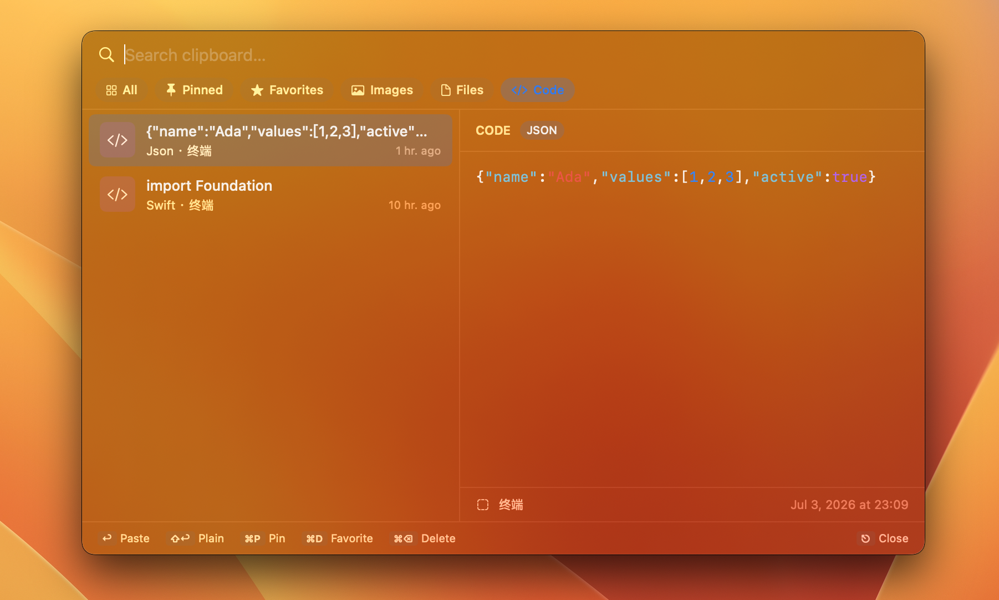

# Clipboard

一个 macOS Ventura+ 原生剪贴板历史应用，对标 Windows 11 的 Clipboard History (Win+V)，UI 风格参考 Raycast / Paste / Maccy / Vercel。

**特点**：**无需 Xcode.app 即可编译**——只用 Command Line Tools + 系统 libsqlite3 就能产出可运行的 `.app`。









## 特性

- 自动监听剪贴板（文本 / 图片 / 文件 / HTML / RTF / Markdown / 代码）
- 语法高亮（Swift / JS/TS / Python / JSON / Bash / HTML / CSS / SQL / YAML 等 10+ 语言）
- SQLite FTS5 全文搜索（bm25 排序）
- 收藏 / 标签 / 固定 / 最近复制
- 自动清理（保留天数 / 最大条数 / 图片总量配额）
- 全局快捷键（默认 ⌥⌘V）
- 菜单栏常驻（`LSUIElement`，无 Dock 图标）
- 开机启动（`SMAppService`）
- 深色模式自动适配（系统语义色）
- 密码管理器复制自动屏蔽（`org.nspasteboard.ConcealedType` 约定）

## 技术栈

- **UI**：SwiftUI + AppKit（NSPanel、NSStatusItem）
- **数据**：手写 SQLite3 C API 封装（`import SQLite3`），零第三方依赖
- **架构**：MVVM + 模块化（`Core/` 纯逻辑，`Features/` 才引入 SwiftUI）
- **目标**：macOS 13.0+
- **构建**：`swiftc` 直接调用 CLT SDK，无需 Xcode.app，无需 SwiftPM

## 构建

### 前提

只需要 Command Line Tools（macOS 自带，或 `xcode-select --install` 安装）：

```bash
xcode-select -p
# 应输出 /Library/Developer/CommandLineTools

swift --version
# 应能输出 Swift 5.8+ 版本
```

### 编译并运行

```bash
cd /Users/mac/Documents/Clipboard
./Scripts/build.sh              # 编 debug 版
./Scripts/build.sh release      # 编 release 版（-O -whole-module-optimization）
./Scripts/build.sh run          # 编完自动 open

open build/Clipboard.app        # 手动启动
```

编译产物：`build/Clipboard.app`，ad-hoc 签名，Mach-O x86_64（Intel）或 arm64（Apple Silicon，自动识别）。

### 安装到 /Applications

```bash
cp -R build/Clipboard.app /Applications/
```

装到 `/Applications` 之后，Launch at Login 才能稳定注册（`SMAppService` 对未签名 + quarantine 状态敏感）。

## 首次运行需要的授权

1. 应用启动后 Dock **不会**出现图标，请看菜单栏右上角有个剪贴板图标
2. 按 `⌥⌘V` 呼出面板
3. 第一次在面板中按 Return 尝试自动粘贴时，系统会弹出 **辅助功能 (Accessibility)** 授权请求
   - 打开 `系统设置 → 隐私与安全性 → 辅助功能`
   - 勾选 Clipboard
4. 如需开机启动，打开设置窗口（菜单栏右键 → Settings…）勾选 "Launch at login"
5. 为什么授权不持久？Scripts/build.sh:150-153 每次 codesign --force --deep --sign - ad-hoc 签名，每次 build cdhash 变，macOS TCC 认这是「新 App」→
    上次的授权作废。等价于每次编译都被清一次
## 存储位置

- 数据库：`~/Library/Application Support/com.local.clipboard/clipboard.sqlite`
- 图片：`~/Library/Application Support/com.local.clipboard/images/<sha256>.png`
- 缩略图：`~/Library/Application Support/com.local.clipboard/thumbs/<sha256>.jpg`
- RTF 归档：`~/Library/Application Support/com.local.clipboard/attributed/<sha256>.dat`

调试时可以直接 `sqlite3` 打开数据库：
```bash
sqlite3 ~/Library/Application\ Support/com.local.clipboard/clipboard.sqlite \
  "SELECT id, kind, detected_language, substr(text_content,1,60) FROM clip_items ORDER BY id DESC LIMIT 10;"
```

## 快捷键

| 快捷键 | 动作 |
|---|---|
| `⌥V` | 呼出/关闭剪贴板面板（可在设置中修改） |
| `↑ / ↓` | 移动选中项 |
| `Return` | 粘贴纯文本到当前应用 |
| `⇧Return` | 粘贴保留原格式 |
| `⌘1..9` | 快速选择前 9 条 |
| `Esc` | 关闭面板 |
| `⌘P` | 固定/取消固定 |
| `⌘D` | 收藏/取消收藏 |
| `⌘⌫` | 删除选中项 |

## 目录结构

```
Sources/Clipboard/
├── App/           入口 + AppDelegate + DI 容器 (AppEnvironment)
├── Core/          纯 Swift + AppKit 服务层
│   ├── Database/           SQLite 手写封装 + Migrations + Repository
│   ├── Pasteboard/         NSPasteboard 轮询监听 + reader/writer + 屏蔽逻辑
│   ├── Hotkey/             Carbon RegisterEventHotKey 封装
│   ├── Panel/              NSPanel 生命周期 + 前置 app 快照
│   ├── Paste/              CGEvent ⌘V 合成 + Accessibility 检测
│   ├── Highlighting/       语法高亮（10+ 语言）
│   ├── Markdown/           Markdown 检测
│   ├── LaunchAtLogin/      SMAppService 封装
│   ├── Cleanup/            定时清理调度器
│   ├── Storage/            FileStore + Hashing
│   └── Util/               Log / Debouncer / Settings
├── Features/      SwiftUI + ViewModel
│   ├── ClipList/           主列表 + 预览面板
│   ├── Search/             搜索栏
│   ├── Tags/               标签芯片和编辑器
│   ├── Favorites/          收藏过滤
│   ├── MenuBar/            NSStatusItem 控制器
│   └── Settings/           TabView 四个 tab
└── Resources/     Assets.xcassets（AppIcon 占位）+ Localizable.strings
```

## Xcode 用户

如果你**未来**装了完整 Xcode.app，可以用 `xcodegen` 生成 `.xcodeproj`：

```bash
brew install xcodegen
xcodegen generate
open Clipboard.xcodeproj
```

`project.yml` 已经准备好，无需修改（CLT-only 路径不用 GRDB，Xcode 路径也可以直接用系统 sqlite3）。

## 已知限制 / 待办

- **Assets.xcassets 无法编译成 `.car`**：CLT 里没有 `actool`。目前所有语法颜色都使用 `NSColor` 语义系统色（`.systemPurple` 等）动态取色，深色模式自动适配。AppIcon 占位符没被编译进 bundle —— app 图标在 Dock/Finder 里会显示为默认的通用图标。
- **未 Notarization**：ad-hoc 签名的 app，别人打开会有 Gatekeeper 警告。本地自用无影响。
- **测试暂缺**：原 XCTest 测试依赖 SPM，已移除。数据层的关键行为已通过 `pbcopy` + `sqlite3` 端到端手动验证。

## 许可

本地自用工具，无正式许可。
